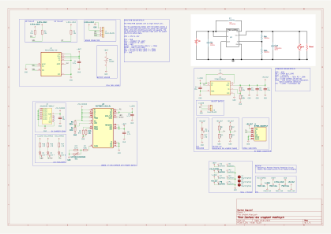
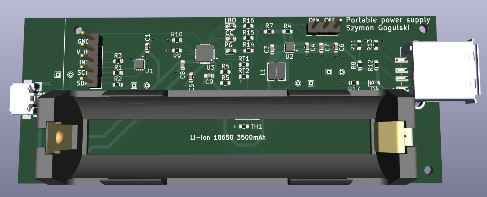

**English version at the bottom.**
#  
Projekt przedstawia przykład zasilacza dla urządzeń mobilnych. Autor Szymon Gogulski
### Główne założenia projektów
1. Zasilacz jest w stanie dostarczyć 1.8A prądu ciągłego do układu zasilanego,
2. Układ zasilany jest z jednego ogniwa LIT-ION 18650.

### Pozostałe zadania
1. Wykonaj testy rzeczywistego urządzenia.
2. Przygotuj dokumentację z opisem.

### Opracowane na podstawie
1. [Battery Charge and System Load Sharing Management With MCP73871 AN1260](https://ww1.microchip.com/downloads/en/Appnotes/01260B.pdf)
2. [MAX17048-MAX17049 Datasheet](https://www.analog.com/media/en/technical-documentation/data-sheets/max17048-max17049.pdf)
3. [MCP73871 Datasheet](https://ww1.microchip.com/downloads/en/DeviceDoc/MCP73871-Data-Sheet-20002090E.pdf)
4. [TPS61022 Datasheet](https://www.ti.com/lit/gpn/TPS61022)
5. [Texas Instruments Power Designer](https://webench.ti.com/power-designer/)
6. [Adafruit Icharging](https://learn.adafruit.com/minty-boost/icharging)
***

### Schemat elektronicznych

### Płytka PCB

### Płytka PCB 3D

### Płytka PCB 3D
